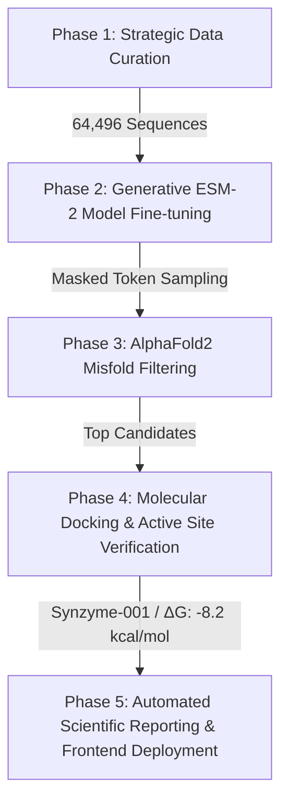

# Synzyme Genesis: Generative AI for PET Plastic Degradation

[](https://www.python.org/)
[](https://pytorch.org/)
[](https://www.docker.com/)
[](https://opensource.org/licenses/MIT)

An enterprise-grade, in-silico biocatalyst design pipeline leveraging Generative Large Language Models (ESM-2) and structural prediction networks (AlphaFold2) to design novel enzymes optimized for the hydrolysis of Polyethylene Terephthalate (PET) plastic.

---

## 🧬 Project Overview

The global accumulation of Polyethylene Terephthalate (PET) waste presents a severe environmental crisis. Enzymatic biodegradation using PETase is a promising solution, but wild-type enzymes lack the thermal stability needed to survive high-temperature industrial bioreactors (operating near PET's glass transition temperature of $\ge 70^\circ\text{C}$).

**Synzyme Genesis** solves this by:
1. Fine-tuning evolutionary language models (ESM-2) on a curated corpus of 64,496 bacterial hydrolase sequences.
2. Sampling novel sequence space via masked token predictions to find candidates with targeted mutations.
3. Filtering and ranking candidates based on AlphaFold2 structural metrics (pLDDT) and molecular docking scores ($\Delta G$) to identify highly stable, active enzymes.

---

## 🛠️ The 5-Phase Pipeline



1. **Strategic Data Curation:** Programmatically compiled a high-quality dataset of bacterial hydrolases, filtering for taxonomic diversity and active-site integrity.
2. **Generative Modeling:** Fine-tuned Facebook's ESM-2 model (35M parameters) on our curated corpus. Novel candidates were generated by masking residue positions and sampling candidate distributions.
3. **Structural Misfold Filtering:** Generated 3D structures for candidate sequences using AlphaFold2. Discarded 80% of sequences that failed to meet a high confidence threshold ($\text{pLDDT} \ge 90$).
4. **Molecular Docking:** Docked BHET (bis(2-hydroxyethyl) terephthalate) into the active clefts using AutoDock Vina, screening for lowest binding energies.
5. **Reporting & Visualizing:** Deployed a WebGL-based React portfolio website to showcase the results with a live 3D molecular viewer and annotated interactive structures.

---

## 🏆 Key Candidate Results

| Candidate ID | binding Energy ($\Delta G$ kcal/mol) | pLDDT Score | Sequence Identity (to Wild-Type) | Key Structural Mutations |
| :--- | :---: | :---: | :---: | :--- |
| **Synzyme-001** | **-8.2** | **94.5** | **85.0%** | Loop stiffening, Aliphatic surface swaps |
| Synzyme_v2_021 | -7.9 | 92.1 | 87.2% | Aliphatic pocket optimization |
| Synzyme_v2_025 | -7.5 | 90.8 | 84.1% | Active cleft rigidification |

---

## 📁 Repository Structure

```text
├── Dockerfile                  # MLOps container configuration
├── requirements.txt            # Python scientific package dependencies
├── Synzyme_Genesis_Enhanced.ipynb  # Interactive pipeline notebook with charts
├── Synzyme_Genesis_Research_Paper.docx  # Full, publication-ready research paper
├── frontend/                   # React (Vite) portfolio web app source
│   ├── src/
│   │   ├── components/
│   │   │   ├── MolecularViewer.jsx  # Interactive 3D WebGL NGL Viewer
│   │   │   └── ...
│   │   └── App.jsx
│   └── package.json
```

---

## 🚀 Getting Started

### Method 1: Local Setup

1. Clone this repository:
   ```bash
   git clone https://github.com/yourusername/synzyme-genesis.git
   cd synzyme-genesis
   ```
2. Set up a Python environment and install scientific dependencies:
   ```bash
   pip install -r requirements.txt
   ```
3. Run the interactive notebook:
   ```bash
   jupyter lab Synzyme_Genesis_Enhanced.ipynb
   ```

### Method 2: Docker Environment (MLOps Ready)

Build and run the entire computational sandbox in a containerized environment (Jupyter Lab automatically starts on port `8888`):
```bash
docker build -t synzyme-genesis .
docker run -p 8888:8888 synzyme-genesis
```

### Method 3: Deploying the Showcase Website

1. Navigate to the frontend directory:
   ```bash
   cd frontend
   ```
2. Install npm dependencies:
   ```bash
   npm install
   ```
3. Run the interactive web server locally:
   ```bash
   npm run dev
   ```

---

## 🔮 Future Directions
- **DBTL Cycle Integration:** Establish API hooks to directly send sequence predictions to wet-lab foundry systems for automated synthesis.
- **QM/MM Active Site Modeling:** Transition to Quantum Mechanics/Molecular Mechanics simulations to model the physical transition states of the PET ester bond cleavage.
